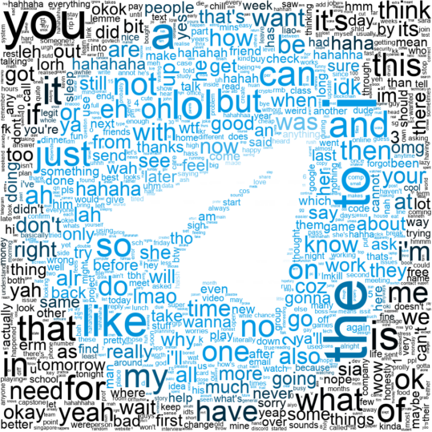
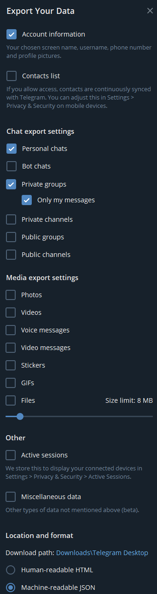
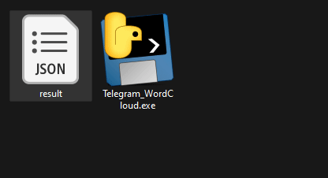

# Telegram WordCloud



## Description
Telegram WordCloud converts all the texts you have sent on Telegram into a fun word cloud. Telegram WordCloud is a completely offline application that does not transmit any data to any remote server.

## Instructions
1. Export your Telegram chats to a JSON file by clicking on `Settings > Advanced > Export Telegram data`, and ensure the following settings are selected:



Note: The export process can take a while, so please be patient, grab a ☕. Mine took around 20 mins

### For Windows
2. Download the latest version of `Telegram_WordCloud.exe` from [here](https://github.com/kensim48/telegram-wordcloud/releases/download/v0.2/Telegram_WordCloud.exe)
3. Drag and drop the JSON file into the `Telegram_WordCloud.exe` as shown below:



### For Linux/MacOS
2. Clone the repository
3. Install the dependencies via `pip install -r requirements.txt`
4. Run `python main.py {{exported_json_name}}`, replacing `{{exported_json_name}}` with the name of the JSON file you exported from Telegram, usually `result.json`

## Additonal Arguments
The following arguments are handled positionally `main.py` script:
```bash
python main.py {{exported_json_name}} {{saved_png_name}} {{txt_file_name_of_ignored_words}}
```
an example:
```bash
python main.py result.json wordcloud_image.png ignored_words.txt
```
This can also be used with the executable file:
```bash
Telegram_WordCloud.exe result.json wordcloud_image.png ignored_words.txt
```